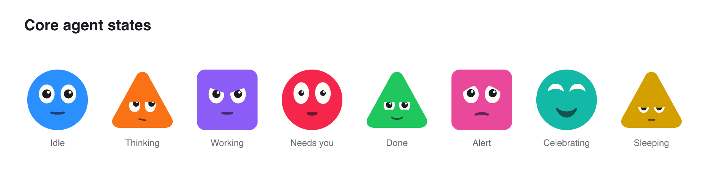
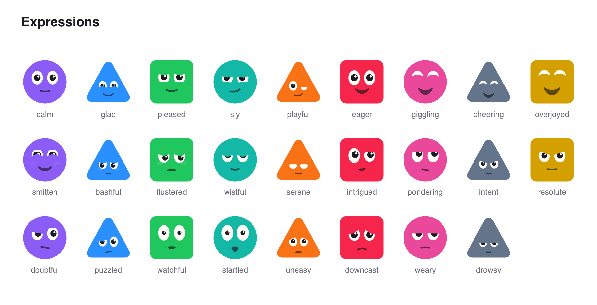

# Agentfaces

[](https://www.npmjs.com/package/agentfaces)
[](https://github.com/ajibadedapo/agentfaces/actions/workflows/ci.yml)
[](https://bundlejs.com/?q=agentfaces)
[](./LICENSE)

Expressive faces for AI agents. Show what an agent is doing (thinking, working, waiting on you, done) with a face people read at a glance. Works with React, React Native and plain SVG.



- **Agent work states**: idle, thinking, working, needs you, done, alert, celebrate and sleeping, plus ten more.
- **Alive, not busy**: blinks, gaze drift, micro saccades, springy body motion, glyph morphs (the body becomes a `!`, `?` or check mark and back) and confetti on celebrate.
- **Accessible by default**: every face has an accessible name and respects reduced motion. The still variant runs no timers.
- **Cheap at scale**: one shared ticker drives every face on screen, and off-screen faces pause.
- **Zero runtime dependencies**, tree-shakeable ESM and CJS builds, full TypeScript types.

[Docs and playground](https://ajibadedapo.github.io/agentfaces/)

## Quick start

```sh
npm install agentfaces
```

```tsx
import { AgentFace } from "agentfaces/react";

<AgentFace state="working" shape="circle" color="#2F6BFF" size={48} />;
```

That is it. Change `state` as your agent works and the face follows.

### React Native

```sh
npm install agentfaces react-native-svg
```

```tsx
import { AgentFace } from "agentfaces/react-native";

<AgentFace state="needs-you" seed={agent.id} name={agent.name} size={56} />;
```

Uses `react-native-svg` and the built-in `Animated` API. No reanimated needed.

### Plain SVG (any framework, server, email)

```ts
import { renderFaceSvg } from "agentfaces/svg";

const svg = renderFaceSvg({ shape: "square", color: "#8B5CF6", state: "done", size: 64 });
```

## Entry points

| Import | What it is |
| --- | --- |
| `agentfaces` | Framework-free core: geometry, expressions, states, the behaviour scheduler and the ticker. Zero dependencies. |
| `agentfaces/react` | `<AgentFace />` and `<AgentFacesProvider />` for the web (client component). |
| `agentfaces/react-native` | The same component for React Native. |
| `agentfaces/svg` | `renderFaceSvg` and `buildFaceSet` for static SVG strings, sprites and manifests. |

## `<AgentFace />`

| Prop | Type | Default | |
| --- | --- | --- | --- |
| `state` | `AgentState` | `"idle"` | What the agent is doing. |
| `shape` | `"circle" \| "triangle" \| "square"` | from `seed` | Body shape. |
| `color` | `string` | from `seed` | Body color. |
| `seed` | `string` | `""` | Stable id that picks shape and color and seeds the motion. |
| `size` | `number` | `48` | Size in pixels (points on native). |
| `expression` | `ExpressionName` | cycles | Hold one expression. |
| `variant` | `"live" \| "still"` | `"live"` | `still` renders one frame with no timers. |
| `mouth` | `boolean` | `true` | Draw the mouth. |
| `label` | `string` | state name | Full accessible name. |
| `name` | `string` | | Builds the accessible name as `"name, state"`. |
| `decorative` | `boolean` | `false` | Hide from assistive technology. |
| `reducedMotion` | `boolean` | OS setting | Force reduced motion on or off. |

## Theme and seeded faces

```tsx
import { AgentFace, AgentFacesProvider } from "agentfaces/react";

<AgentFacesProvider shapes={["circle", "square"]} palette={["#2F6BFF", "#13B8A7", "#F97216"]} size={40}>
  {agents.map((agent) => (
    <AgentFace key={agent.id} seed={agent.id} name={agent.name} state={agent.state} />
  ))}
</AgentFacesProvider>;
```

The provider also takes `variant`, `mouth`, `reducedMotion` and `labels` (to translate state names). Outside React, `faceFor(seed, { shapes, palette })` from `agentfaces` returns the same `{ shape, color }` pick.

## States

| Group | States |
| --- | --- |
| Core work states | `idle`, `thinking`, `working`, `needs-you`, `done`, `alert`, `celebrate`, `sleeping` |
| Extended | `starting`, `attentive`, `exploring`, `waiting`, `handing-off`, `heads-up` |
| Ornaments | `typing` (ellipsis), `running` (spinner), `monitoring` (ripple), `background` (tracker) |

`alert`, `needs-you` and `done` morph the body into `!`, `?` and a check mark. `celebrate` throws confetti. Morphs, ornaments and confetti are skipped under reduced motion and in the still variant.

## Expressions



`calm`, `glad`, `pleased`, `sly`, `playful`, `eager`, `giggling`, `cheering`, `overjoyed`, `smitten`, `bashful`, `flustered`, `wistful`, `serene`, `intrigued`, `pondering`, `intent`, `resolute`, `doubtful`, `puzzled`, `watchful`, `startled`, `uneasy`, `downcast`, `weary`, `drowsy`. Holding `smitten` morphs the body into a heart.

## Static exports

`buildFaceSet(shape, color?)` from `agentfaces/svg` returns every state and expression as SVG files, a `sprite.svg` of `<symbol>`s and a `manifest.json`. Bodies default to `currentColor`, so set `color` on the host element to tint them. From a clone of this repo, `npm run export:stills` writes the full set to `dist/stills`.

## Small sizes

Below 64 px the face grows inside the body and simplifies. From 36 px down the eyes become solid ink on a pixel grid and the mouth gets a full-pixel line, so 24 px avatars still read as faces.

## Contributing

See [CONTRIBUTING.md](./CONTRIBUTING.md). Releases are automated with changesets and published from CI with npm provenance.

## License

[MIT](./LICENSE). Created by [Hammed Ajibade](https://github.com/ajibadedapo). Built at Specvista. See [PROVENANCE.md](./PROVENANCE.md) for how the artwork and motion were made.
